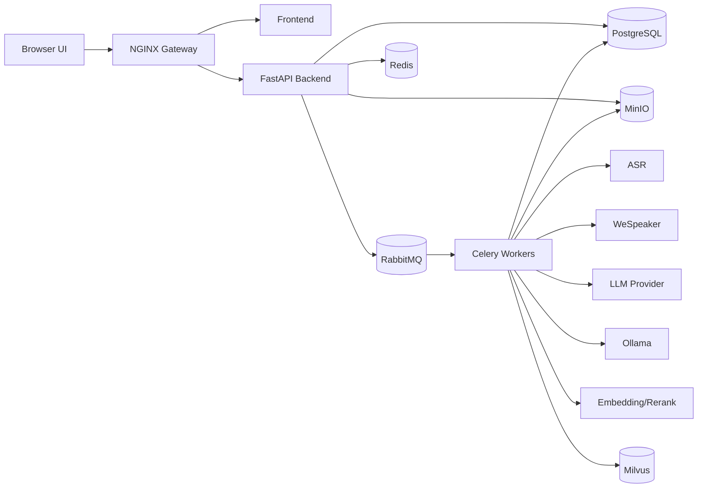

<div align="center">

# Omnicall

Meeting intelligence chatbot for processed transcript JSON retrieval.


[System](#system-overview) · [Flow](#system-flow) · [Quick Start](#quick-start) · [Pipelines](#application-pipelines) · [Repo Map](#repository-map) · [Docs](#documentation-index)

</div>

## System Overview

Omnicall turns uploaded or recorded meetings into a versioned `meeting_intelligence_result` JSON. The chatbot retrieves from that JSON first, then uses transcript entries inside the same JSON for citations and fallback evidence.

| Area | Current Direction |
|---|---|
| Public entry | NGINX gateway implemented for local runtime |
| Frontend | Vite React meeting workspace implemented |
| API | FastAPI backend with health and meeting upload APIs implemented |
| Async work | Backend publishes Celery tasks to RabbitMQ; Celery worker processes meetings |
| Durable state | PostgreSQL running in local Compose |
| File bytes | MinIO running in local Compose |
| Cache/locks | Redis running in local Compose |
| Retrieval | Processed JSON chunking, PostgreSQL chunk records, Milvus vector index, rerank, and chat citations |
| Local models | Compose bootstraps Ollama models into `ollama_data` and specialist model snapshots into `model_cache` |
| LLM | API/private endpoint first, Ollama fallback |

## System Flow



## Quick Start

Run the local stack:

```bash
docker compose up -d --build
docker compose exec -T backend alembic upgrade head
```

Then call the backend through the gateway:

```bash
curl http://127.0.0.1:8080/api/health
```

Expected response:

```json
{"app":"Omnicall API","status":"ok"}
```

Useful local URLs:

| Service | URL |
|---|---|
| Gateway | `http://127.0.0.1:8080` |
| Adminer | `http://127.0.0.1:8081` |
| MinIO Console | `http://127.0.0.1:8082` |
| Milvus WebUI | `http://127.0.0.1:8083/webui` |
| RedisInsight | `http://127.0.0.1:8084` |
| RabbitMQ Management | `http://127.0.0.1:8085` |
| Prometheus | `http://127.0.0.1:8086` |
| Ollama | `http://127.0.0.1:11434` |

## Application Pipelines

| Pipeline | Status | Flow |
|---|---|---|
| Backend health | Implemented | NGINX -> backend middleware -> controller -> service -> DTO |
| Local infrastructure | Implemented | Compose -> gateway/backend/PostgreSQL/Redis/RabbitMQ/MinIO/Milvus/Prometheus |
| Meeting upload and queue | Backend implemented | Auth headers -> meeting -> MinIO asset -> PostgreSQL metadata -> RabbitMQ task |
| Meeting workspace UI | Implemented | Gateway -> Vite React -> meeting APIs |
| Backend tests | Implemented | `unittest` -> gateway API + SQLAlchemy persistence + service retry checks |
| Meeting processing worker | Implemented | RabbitMQ -> Celery worker -> transcript -> LLM analysis -> processed JSON -> indexes |
| Voice processing | Implemented | Audio -> ffmpeg WAV -> VAD -> local ASR command -> diarization command -> transcript entries |
| JSON intelligence | Implemented | Transcript -> LLMProvider -> validated `meeting_intelligence_result` |
| RAG chat | Implemented | Question -> Ollama embedding -> JSON chunks -> rerank command -> LLM answer with citations |
| Guardrails | Implemented | Transcript/input/context/output -> local Ollama guardrail -> safe warnings/refusals |

## Deployment Profiles

| Profile | Model Strategy | Notes |
|---|---|---|
| Local dev | Compose Ollama for fallback LLM, embedding, guardrails; local command adapters for ASR/diarization/rerank | `ollama-init` and `model-init` prepare model volumes before app services start |
| Hybrid | Local voice/embedding/rerank/guardrails with private LLM endpoint | Recommended development path |
| Production | Private/API LLM with local voice, embedding, rerank, and guardrail models | Requires auth, retention, audit, and observability hardening |

## Repository Map

```text
.
├── AGENTS.md                         <- Project rules for AI/code sessions
├── README.md                         <- Project hub
├── docker-compose.yml                 <- Local runtime wiring
├── .env.example                      <- Runtime environment template
├── .dockerignore                     <- Docker build context ignores
├── backend/                          <- FastAPI backend service
│   ├── Dockerfile                    <- Backend container image
│   ├── configs/                      <- Runtime configuration
│   ├── controllers/                  <- HTTP route handlers
│   ├── dependencies/                 <- FastAPI dependencies
│   ├── dtos/                         <- Request/response contracts
│   ├── migrations/                   <- Alembic migrations
│   ├── middlewares/                  <- Request/response middleware
│   ├── models/                       <- SQLAlchemy models
│   ├── providers/                    <- Storage and queue adapters
│   ├── repositories/                 <- Database access abstractions
│   ├── services/                     <- Business services/use cases
│   ├── tasks/                        <- Celery task definitions
│   ├── utils/                        <- Shared utilities
│   ├── main.py                       <- App factory and route registration
│   └── requirements.txt              <- Backend dependencies
├── frontend/                         <- Vite React frontend service
│   ├── src/
│   │   ├── routes/                   <- Thin route composition
│   │   ├── layouts/                  <- App shell
│   │   ├── components/               <- Shared UI
│   │   ├── styles/                   <- Global CSS
│   │   └── features/meetings/        <- Meeting feature layers
│   ├── Dockerfile                    <- Frontend container image
│   └── package.json                  <- Frontend scripts/dependencies
├── infras/                           <- Infrastructure service config
│   ├── nginx/                        <- Gateway config
│   └── prometheus/                   <- Metrics scrape config
└── docs/
    ├── explanations/                 <- Source-derived explanations
    ├── plans/                        <- Roadmap and phase checklists
    ├── rules/                        <- Documentation rules
    └── PROJECT_PLAN.md               <- Planning index
```

## Documentation Index

| Document | Purpose |
|---|---|
| `docs/plans/0 - project overview.md` | Product, architecture, model provider strategy, API surface |
| `docs/plans/1 - repository foundation.md` | Completed repository foundation checklist |
| `docs/plans/2 - local runtime and infrastructure.md` | Completed local Compose runtime checklist |
| `docs/plans/3 - meeting upload and core records.md` | Completed meeting upload and core records checklist |
| `docs/explanations/backend-explanation.md` | Implemented backend structure and behavior |
| `docs/explanations/frontend-explanation.md` | Implemented frontend structure and behavior |
| `docs/explanations/infrastructure-explanation.md` | Implemented Docker Compose and infrastructure behavior |
| `docs/explanations/documentation-explanation.md` | Documentation rules and README/frontend conventions |
| `AGENTS.md` | Project rules for future coding sessions |

## Notes On Accuracy

- The backend health endpoint is implemented.
- Backend health was verified with FastAPI TestClient and a live Uvicorn `curl` check using temporary dependencies installed outside the repo.
- Docker Compose local runtime is implemented and verified for NGINX, backend, PostgreSQL, Redis, RabbitMQ, MinIO, Milvus, Prometheus, Adminer, and RedisInsight.
- Ollama is now part of Compose and is exposed only on localhost for local model runtime access.
- `ollama-init` pulls `qwen2.5:1.5b`, `nomic-embed-text`, and `llama-guard3:1b` into `ollama_data`.
- `model-init` downloads ASR, diarization, and rerank Hugging Face snapshots into `model_cache`.
- Alembic baseline migrations, meeting creation, file upload metadata, MinIO object upload, and RabbitMQ job enqueueing are implemented and verified through the gateway.
- The frontend meeting workspace is implemented and verified with Vite build, Playwright desktop/mobile screenshots, and a Playwright create/upload/process smoke test.
- Backend `unittest` coverage verifies auth, workspace scoping, upload validation, idempotency, persistence, status responses, queue failure visibility, and retry job creation.
- Current meeting APIs use development auth headers. Production authentication is planned.
- Worker execution, processed JSON indexing, RAG chat, rerank metadata, and local guardrail checks are implemented.
- Voice uploads use repository-owned ASR and diarization runners with fixed CPU-friendly model/runtime contracts.
- `model-init` downloads the required ASR, diarization, and rerank snapshots into the fixed `/models` volume before backend and worker startup.
