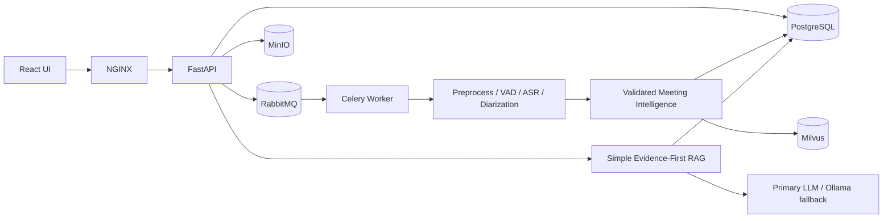

<div align="center">

# Omnicall

Evidence-first meeting intelligence and verified conversational answers.


[System](#system-overview) · [Flow](#system-flow) · [Quick Start](#quick-start) · [Pipelines](#application-pipelines) · [Deployment](#deployment-profiles) · [Repository](#repository-map) · [Docs](#documentation-index)

</div>

## System Overview

Omnicall turns meeting audio into validated transcript and intelligence records. PostgreSQL is authoritative, MinIO retains source bytes, Milvus stores derived embeddings, and the only chat path is `simple-rag.v1`.

| Boundary | Responsibility |
|---|---|
| Frontend | Meeting workspace, recording/playback, citations, and `pipelineTrace v1` |
| Gateway | Public routing and edge concerns |
| Backend | Authorization, APIs, turn lifecycle, validation, and durable state |
| Worker | Retryable audio processing, extraction, validation, indexing, and chat execution |
| PostgreSQL | Meetings, assets, transcripts, intelligence, chunks, snapshots, chat, and feedback |
| MinIO | Source audio and file bytes |
| Redis | Temporary locks, task/idempotency state, and streams; no answer cache or Agent Memory |
| Milvus | Derived vectors tied to the current retrieval generation |

## System Flow



The chat path is fixed:

```text
Request gate -> QuerySpec -> Retrieval plan -> EvidenceBundle
-> Evidence validation -> LLM synthesis -> Answer verification
-> Output policy -> Persistence
```

Successful direct and meeting answers are written by an LLM. Only clarification, `not_enough_evidence`, blocked, and error/control states use fixed responses.

## Quick Start

```bash
cp .env.example .env
docker compose up -d --build
docker compose exec -T backend alembic upgrade head
curl http://127.0.0.1:8080/api/health
```

Run verification:

```bash
docker compose exec -T backend \
  python -m unittest discover -s backend/tests -p 'test_*.py'
npm --prefix frontend test
npm --prefix frontend run build
docker compose config -q
```

| Local service | URL |
|---|---|
| Gateway | `http://127.0.0.1:8080` |
| Adminer | `http://127.0.0.1:8081` |
| MinIO Console | `http://127.0.0.1:8082` |
| Milvus WebUI | `http://127.0.0.1:8083/webui` |
| RedisInsight | `http://127.0.0.1:8084` |
| RabbitMQ | `http://127.0.0.1:8085` |
| Prometheus | `http://127.0.0.1:8086` |
| Ollama | `http://127.0.0.1:11434` |

## Application Pipelines

| Pipeline | Current flow |
|---|---|
| Upload | Auth -> meeting row -> MinIO asset -> RabbitMQ processing task |
| Processing | Source audio -> preprocess/VAD -> ASR/diarization -> window extraction -> evidence validation -> whole-meeting summary -> PostgreSQL/Milvus snapshot |
| Chat | Durable queued turn -> request guardrail -> `QuerySpec` -> deterministic retrieval -> `EvidenceBundle` -> LLM synthesis -> mandatory verification -> output guardrail -> message persistence/SSE |
| Direct intent | Deterministic intent classification -> LLM natural-language synthesis -> output guardrail |
| Feedback | Rating persistence only; returns `memory_status=disabled` and `cache_action=disabled` |
| Diagnostics | Owner-visible bounded `pipelineTrace v1`; no full prompt, hidden reasoning, raw tool trace, or credentials |

## Deployment Profiles

| Profile | Model strategy | Status |
|---|---|---|
| Local development | Ollama plus local audio/embedding/rerank models | Supported |
| Hybrid | Private OpenAI-compatible primary with Ollama fallback | Supported |
| Direct cutover | One Simple RAG image set, previous image digests and restore-tested PostgreSQL dump for rollback | Phase 47 acceptance in progress |

There is no `legacy`, `shadow`, `canary`, or runtime pipeline-mode switch. Rollback uses previous images/git revision and the validated database backup.

## Repository Map

```text
.
├── backend/
│   ├── controllers/              <- HTTP boundaries
│   ├── repositories/             <- Data access only
│   ├── services/
│   │   ├── simple_rag/           <- Query, retrieval, synthesis, verification contracts
│   │   ├── processing/           <- Audio/intelligence/index stages
│   │   └── retrieval/            <- Chunk and search lifecycle
│   ├── tasks/                    <- Celery entry points
│   ├── scripts/                  <- Safe reset/rebuild operations
│   └── migrations/               <- Alembic schema history
├── frontend/src/
│   ├── routes/                   <- Framework-native routing
│   ├── features/                 <- Feature-layered UI
│   └── shared/                   <- Cross-feature UI/utilities
├── infras/                       <- NGINX, Prometheus, model bootstrap
├── docs/explanations/            <- Source-derived behavior
├── docs/plans/                   <- Roadmap and acceptance status
└── docker-compose.yml            <- Local service wiring
```

## Documentation Index

| Document | Purpose |
|---|---|
| `docs/plans/47 - query graph discourse and evidence branch architecture.md` | Direct-cutover checklist and current acceptance status |
| `docs/plans/0 - project overview.md` | Project-wide architecture and runtime settings |
| `docs/explanations/backend-explanation.md` | Backend services, contracts, persistence, and security |
| `docs/explanations/worker-explanation.md` | Processing/chat task ownership and retries |
| `docs/explanations/infrastructure-explanation.md` | Compose settings, backup/reset/deploy/rollback |
| `docs/explanations/frontend-explanation.md` | Feature layers and `pipelineTrace v1` viewer |

## Notes On Accuracy

- The Simple RAG source, settings, migration, frontend trace viewer, backup, and reset tooling are implemented.
- The final candidate backend image passes `191/191`; focused Simple RAG/provider/retrieval tests and frontend tests/build also pass.
- The PostgreSQL backup was restored successfully into an isolated database before reset tooling was accepted.
- The destructive two-meeting reset, source-audio reprocessing, full live golden replay, new-image deployment, and smoke acceptance are intentionally pending until every strict gate passes.
- The NVIDIA credential rotation is an external operational action and cannot be completed by source changes.
- Public chat endpoints and the durable SSE/history lifecycle remain stable; diagnostics metadata changed to `pipelineTrace v1`.
